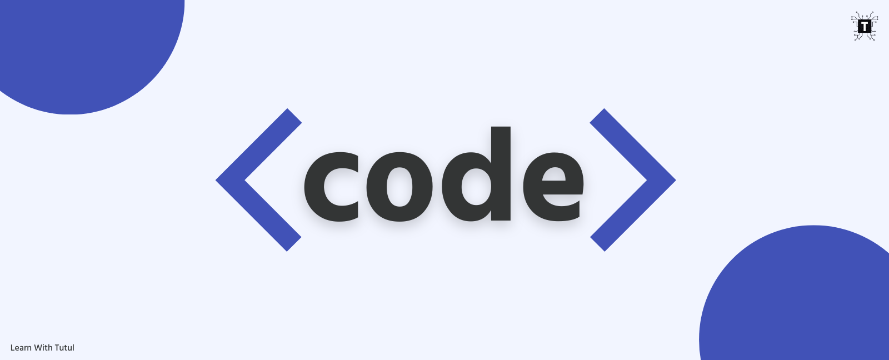

<h1 align="center">Hi 👋, I'm MD SANIAT HOSSAIN</h1>
<h3 align="center">Programmer | Web Designer | Content Creator | Speed Learner</h3>
<h4 align="center">Co-founder & Chief Operating Officer at Hablu Programmer</h4>

  

---

## 🛠 Skills

  <strong>Languages & Tools:</strong>  
  C | C++ | Java | Python | Bootstrap | React | JavaScript | HTML | CSS

---

## 🔭 What I'm Working On

- [Hablu Programmer](https://www.hablu-programmer.com/)
- [Two Unique Solution](https://twouniquesolution.com/)

---

## 🌱 What I'm Learning

- Currently diving deeper into Golang, Java, and C++

---

## 👨‍💻 Projects

- Check out my projects on [GitHub](https://github.com/Saniat-hossain)

---

## 📝 Blog

- I regularly write articles on [Learn with Tutul](https://www.learnwithtutul.xyz/)

---

## 💬 Ask Me About

- HTML5, CSS3, JavaScript, Bootstrap

---

## 📫 How to Reach Me

- Email: **saniathossain66@gmail.com**

---

## 📈 GitHub Stats

  

  
  

  

---

## 📱 Connect with Me

  
  
  

